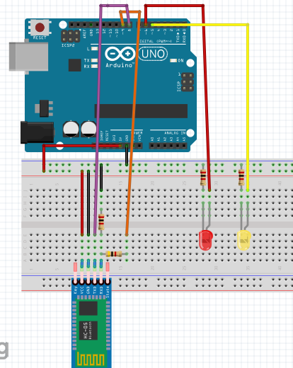
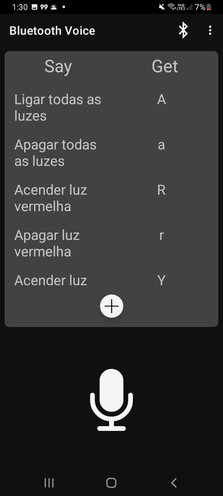

## Microcontroladores e Microcessadores: Projeto Final
# Controlando luzes com comandos de voz

O projeto se baseia no desenvolvimento de um circuito em Arduíno para controlar
LEDs utilizando comandos de voz através do sensor de voz do celular. A conexão com o celular
é realizada via o módulo bluetooth HC-6. A interface entre o usuário e o controlador é
feita através do aplicativo Bluetooth Voice, o qual utiliza o reconhecimento de voz do
Google para gerar comandos que podem ser utilizados na programação do circuito. O link
do código se encontra no arquivo led_control.ino.

## Materiais Utilizados

1. Arduino UNO;
2. Módulo Bluetooth HC-06;
3. LED vermelho e LED amarelo;
4. 2 Resistores de 1 kΩ (para os LEDs);
5. 1 resistor de 2kΩ e 1 resistor de 4kΩ (Divisor de tensão)
6. Jumpers;

## Circuito do projeto

# Configuração do Bluetooth Voice

